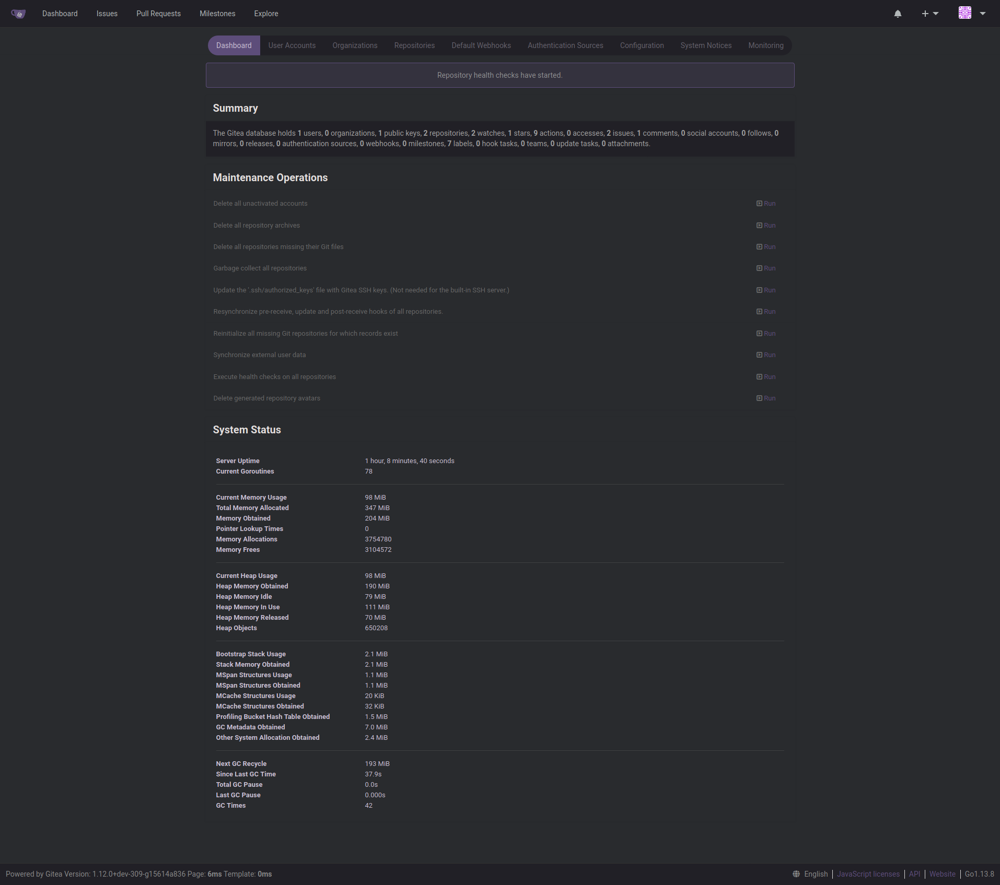
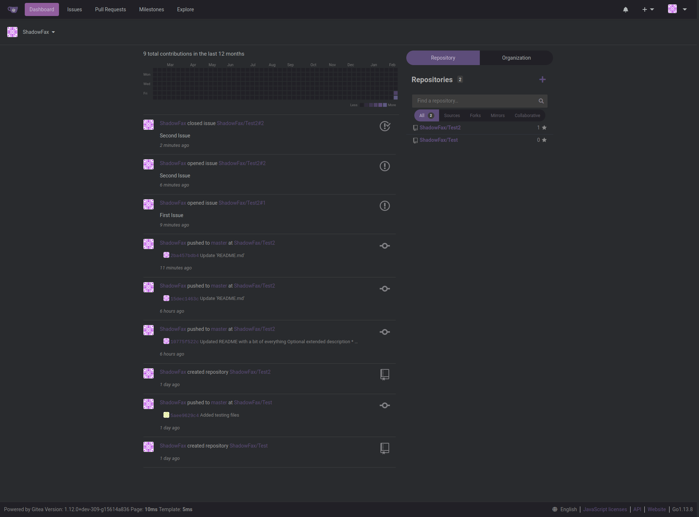
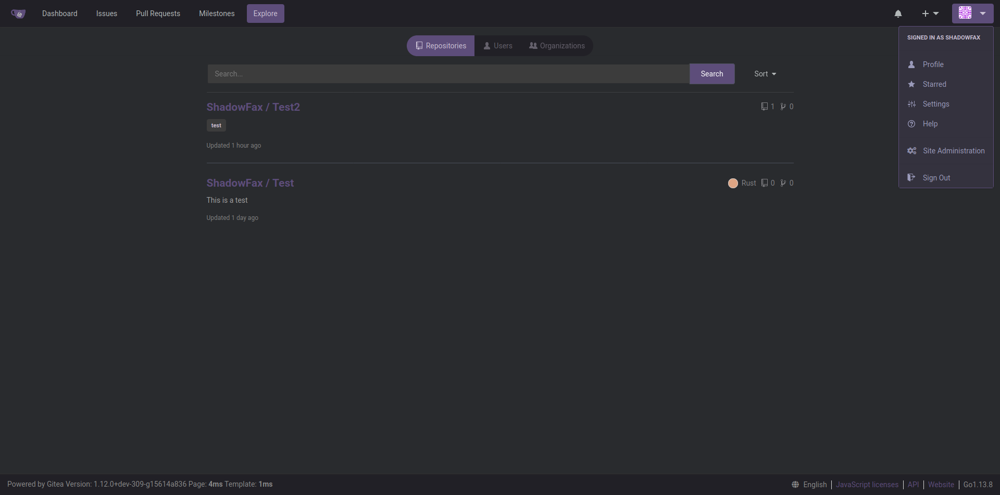
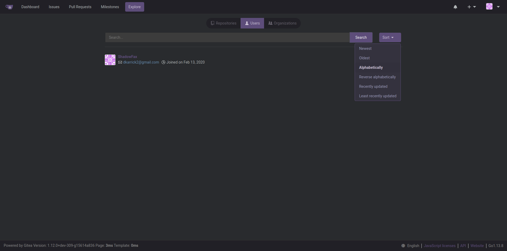
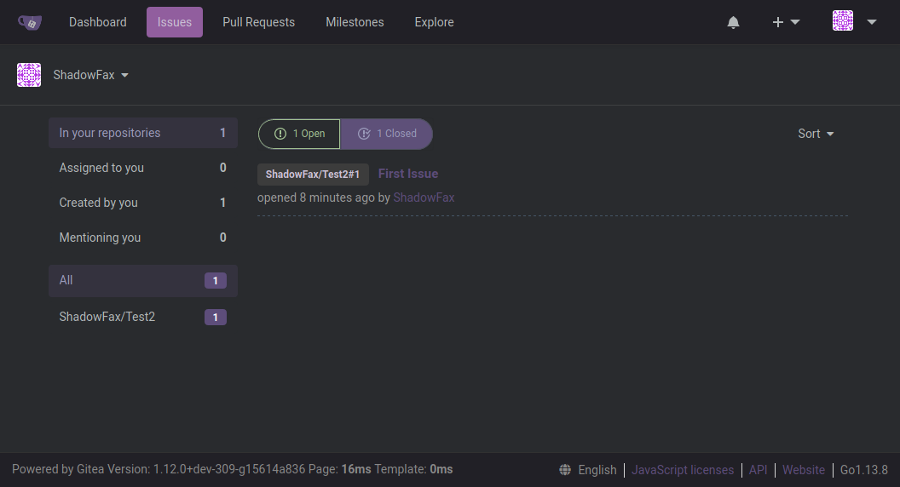
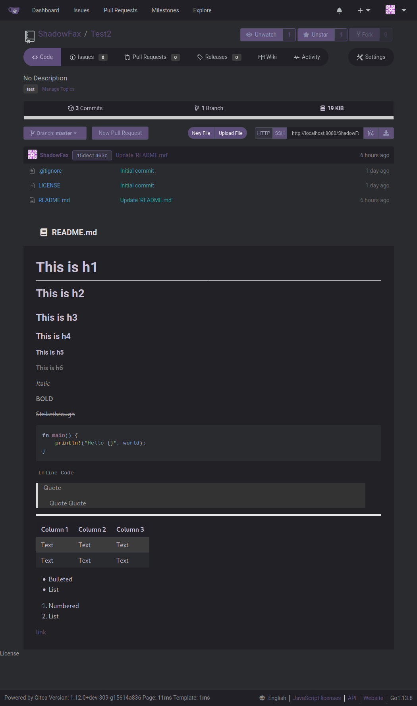
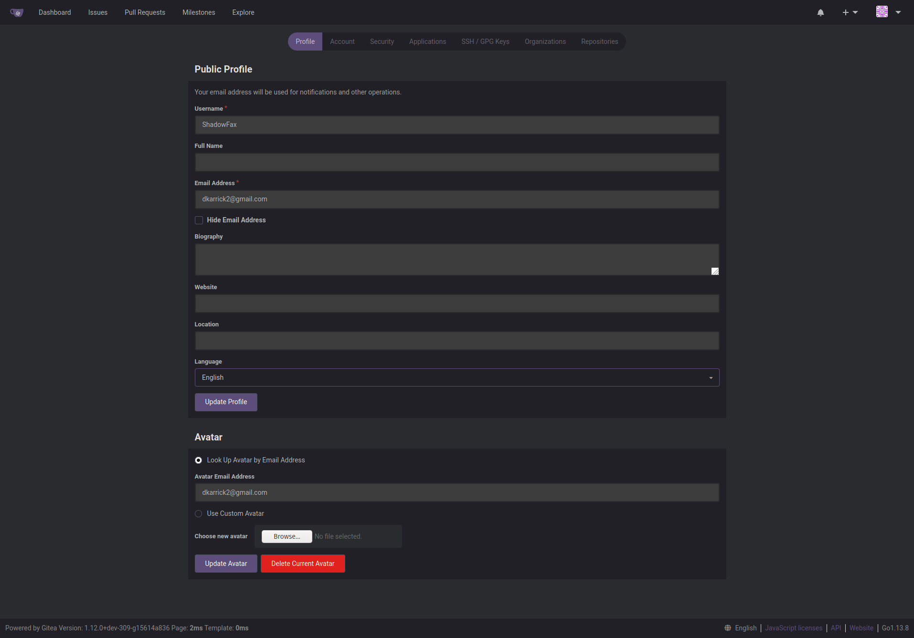

# Space Theme

Spacemacs Theme for Gitea

**Features**

* Spacemacs Theme
* Rounded Tabs
* Removed outlines from many places

## Screenshots

### Future Goals

* I'd like to map the colors a little bit better
  * Red Buttons don't look like they belong
* Rounder Buttons
* Remove Semantic UI
  * Uses a lot of `!important`
  * Is a pain to overwrite
  * Removing it would let me drop some custom templates
  * I'm a bigger fan of Bulma
  * If I use another css I'll use purgecss to remove anything I don't need

### Maybe if I find time

* [Isometric Heatmap](https://github.com/jasonlong/isometric-contributions)
* [turn language-specific statements like `include` `require` or `import` into links.](https://github.com/OctoLinker/OctoLinker)
* [Toggleable File Tree](https://github.com/ovity/octotree)
* [Custom Tab Sizes](https://github.com/lukechilds/github-custom-tab-size)
* [Module Linker](https://module-linker.alhur.es/)
* [Code Folding](https://github.com/noam3127/github-code-folding)
* [Builds Tab](https://github.com/duxet/builds-tab)
* [Add breakpoints at 1400px, 1600px and 1800px for full GitHub experience on large screens. Also removes the truncating of file and directory names in the repository browser](https://github.com/stefanbuck/awesome-browser-extensions-for-github)
* [Codeflower Tab](https://github.com/code-flower)
* [Organized News Feed](https://github.com/lockys/Octotab.crx)
* [Notification Preview](https://github.com/tanmayrajani/notifications-preview-github)
* [check if the profile you are visiting, follows you or not in a Twitter-like UI](https://github.com/mkstn/follow-me-or-not)
* [Add Hovercards](https://github.com/Justineo/github-hovercard)
* [Add vscode icons for different filetypes](https://github.com/dderevjanik/github-vscode-icons)
